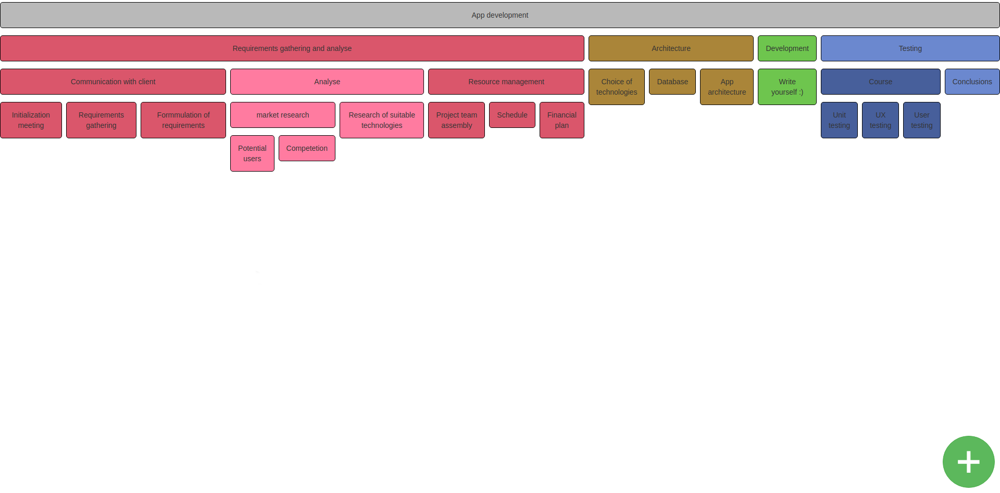

React tree app
==============

This app demonstrate using React on the tree structure. App can be used for building structures like WBS.

## Requirements

- NPM
- Node

App use React, Webpack and Babel.

## How to run app

- Go to `/server` and run `npm install`
- Run `node .` in `/server` directory
- Go to `/` and run `npm install`
- Run `npm start` in `/` directory

App will appear on `localhost:8080` url.

## Example

-------

Made by Patrik Valkovic

Licence: GPLv3